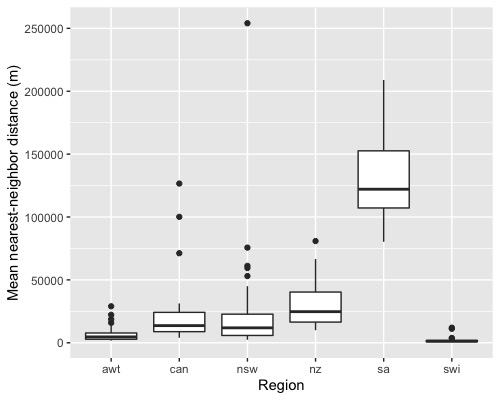

```{r setup, include=FALSE}
knitr::opts_chunk$set(echo = TRUE, tidy = TRUE, tidy.opts=list(width.cutoff=80), fig.align="center")
```

This document provides example code for visualising the NCEAS data within the  `disdat` package. This html file is created using R markdown. The code in the grey shaded areas that is not preceded by # can be copied and run in R. The code preceded by ## simply shows what the code above it returns. 

We need to load the `disdat` package first.

```{r}
# install.packages('disdat')
# devtools::install_github('rspatial/disdat')
library(disdat)

```


## Correlation matrix

Here is one example of how to create correlation matrices showing spearman rank correlation coefficients between all pairs of environmental variables. We use the AWT background data for our sample.

```{r paged.print=TRUE}
awt <- getDisData('AWT', 'train', 'bg')
head(awt)
```

Now we can create the correlation matrix for this dataset.

```{r fig.height=4, fig.width=5}
library(GGally)

ggcorr(awt[, 7:ncol(awt)],
       method = c("pairwise", "spearman"),
       label = TRUE,
       label_size = 3,
       label_color = "white",
       digits = 2) +
  theme(legend.justification = c(1, 0),
        legend.position = c(0.5, 0.7),
        legend.direction = "horizontal") +
  guides(fill = guide_colorbar(barwidth = 9, 
                               barheight = 1, 
                               title.position = "top", 
                               title.hjust = 0.5, 
                               title = "Spearman correlation"))
```


## Density plots

This code shows how to create a density plot showing the density of records for species (one or many) vs that in the landscape, across one environmental variable in one region. We use all species in AWT across as an example. We plot density of records across variable "bc01", which is Annual mean temperature.

```{r message=FALSE, warning=FALSE}
library(tidyverse)

```

```{r}
# create density plot for species presence-only vs background data
# first prepare the species records in the right format for the tidyverse package:
po <- getDisData('AWT', 'train', 'po') # presence-only data
bg <- getDisData('AWT', 'train', 'bg') # background data
spdata <- rbind(po, bg)
spdata$occ <- as.factor(spdata$occ)
levels(spdata$occ) <- c("Landscape", "Species")
levels(spdata$occ)

```

```{r fig.height=4, fig.width=5.5}
# now plot the data - specify the variable by its column name, as seen below in "aes(x = bc01,.....)"
ggplot(data = spdata, aes(x = bc01, fill = occ)) +
  geom_density(alpha = 0.4) +
  xlab("Annual mean temperature") +
  scale_fill_brewer(palette = "Dark2") +
  guides(fill = guide_legend(title = "")) +
  theme_bw()

```

## Nearest-neighbour distance

You might be interested in distances between sites. There are various reasons for thinking about this, and various ways to calculate it. Here is one example, which simply asks: what is the **average nearest-neighbour distance** per species in each region, in the PO data. The distance is calculated in *metres*. This gives an indication of the clustering of sites in a region, which will be influenced by several things: density of sampling, biases in sampling (e.g. do recorders tend to go to the same general areas within the region), whether the selected species are spread throughout the region or clustered.   
    
Example code for calculating the mean nearest-neighbor distance for one region - here, we use AWT:

```{r message=FALSE, warning=FALSE}
library(sf)
library(tidyverse)

awt_sf <- getDisData('AWT', 'train', 'po') %>%  # presence-only data
  st_as_sf(coords = c("x", "y"), crs = 28355)

# a function to calculate the min distance (excluding self-distance)
mindist <- function(x) {
  mindis <- vector(mode = "numeric", length = nrow(x))
  for(i in 1:nrow(x)){
    mindis[i] <- min(x[i, -i])
  }
  return(mindis)
}

awt_min_dist <- awt_sf %>% 
  group_by(spid) %>% 
  nest() %>% 
  mutate(distM = map(data, ~st_distance(x = .)),
         minDist = map(distM, ~mindist(x = .)),
         meanDist = map_dbl(minDist, ~mean(x = .)))
awt_min_dist

```

The code produces a “tibble”. You could, for instance, summarise the `meanDist` column: `summary(awt_min_dist$meanDist)`.

If you ran this code for all regions you could then create a figure like this:

```{r echo=FALSE, eval=FALSE, fig.height=4, fig.width=5, message=FALSE, warning=FALSE}
library(sf)
library(tidyverse)

awt <- getDisData('AWT', 'train', 'po') # presence-only data
can <- getDisData('CAN', 'train', 'po') # presence-only data
nsw <- getDisData('NSW', 'train', 'po') # presence-only data
nz <- getDisData('NZ', 'train', 'po') # presence-only data
sa <- getDisData('SA', 'train', 'po') # presence-only data
swi <- getDisData('SWI', 'train', 'po') # presence-only data

mindist <- function(x) {
  mindis <- vector(mode = "numeric", length = nrow(x))
  for(i in 1:nrow(x)){
    mindis[i] <- min(x[i, -i])
  }
  return(mindis)
}

awt_sf <- st_as_sf(awt, coords = c("x", "y"), crs = 28355)
awt_sf_group <- awt_sf %>% 
  group_by(spid) %>% 
  nest() %>% 
  mutate(distM = map(data, ~st_distance(x = .)),
         minDist = map(distM, ~mindist(x = .)),
         meanDist = map_dbl(minDist, ~mean(x = .)))
# awt_sf_group

can_sf <- st_as_sf(can, coords = c("x", "y"), crs = 4008)
can_sf_group <- can_sf %>% 
  group_by(spid) %>% 
  nest() %>% 
  mutate(distM = map(data, ~st_distance(x = .)),
         minDist = map(distM, ~mindist(x = .)),
         meanDist = map_dbl(minDist, ~mean(x = .)))
# can_sf_group

nsw_sf <- st_as_sf(nsw, coords = c("x", "y"), crs = 4326)
nsw_sf_group <- nsw_sf %>% 
  group_by(spid) %>% 
  nest() %>% 
  mutate(distM = map(data, ~st_distance(x = .)),
         minDist = map(distM, ~mindist(x = .)),
         meanDist = map_dbl(minDist, ~mean(x = .)))
# nsw_sf_group

nz_sf <- st_as_sf(nz, coords = c("x", "y"), crs = 27200)
nz_sf_group <- nz_sf %>% 
  group_by(spid) %>% 
  nest() %>% 
  mutate(distM = map(data, ~st_distance(x = .)),
         minDist = map(distM, ~mindist(x = .)),
         meanDist = map_dbl(minDist, ~mean(x = .)))
# nz_sf_group

sa_sf <- st_as_sf(sa, coords = c("x", "y"), crs = 4326)
sa_sf_group <- sa_sf %>% 
  group_by(spid) %>% 
  nest() %>% 
  mutate(distM = map(data, ~st_distance(x = .)),
         minDist = map(distM, ~mindist(x = .)),
         meanDist = map_dbl(minDist, ~mean(x = .)))
# sa_sf_group

swi_sf <- st_as_sf(swi, coords = c("x", "y"), crs = 21781)
swi_sf_group <- swi_sf %>% 
  group_by(spid) %>% 
  nest() %>% 
  mutate(distM = map(data, ~st_distance(x = .)),
         minDist = map(distM, ~mindist(x = .)),
         meanDist = map_dbl(minDist, ~mean(x = .)))
# swi_sf_group

mean_dist <- data.frame(
  region = c(
    rep("awt", nrow(awt_sf_group)),
    rep("can", nrow(can_sf_group)),
    rep("nsw", nrow(nsw_sf_group)),
    rep("nz", nrow(nz_sf_group)),
    rep("sa", nrow(sa_sf_group)),
    rep("swi", nrow(swi_sf_group))
  ),
  dist = c(
    awt_sf_group$meanDist,
    can_sf_group$meanDist,
    nsw_sf_group$meanDist,
    nz_sf_group$meanDist,
    sa_sf_group$meanDist,
    swi_sf_group$meanDist
  )
)

ggplot(mean_dist, aes(x = region, y = dist)) +
  geom_boxplot() +
  xlab("Region") + ylab("Mean nearest-neighbor distance (m)")

```
   
   
```{r, out.width = 400, echo=FALSE}

``` 

## Mapping species data
This code shows how to map the species presence-only and the evaluation presence-absence data. For doing this we use [tmap](https://github.com/mtennekes/tmap) and [mapview](https://github.com/r-spatial/mapview) packages.

### Plotting static map
We use tmap package to plot species data on one of the environmental rasters (grids).

```{r fig.height=5, fig.width=7, message=FALSE, warning=FALSE}
library(sf)
library(tmap)
library(grid)

# loading the data
r <- getBorder('NSW') # a polygon file showing border of the region
podata <- getDisData('NSW', 'train', 'po') # presence-only data
padata <- getDisData('NSW', 'test', 'pa', 'db') # presence-absence of group db for species 'nsw14'

# select the species to plot
species <- "nsw14"
# convert the data.frame to sf objects for plotting
po <- st_as_sf(podata[podata$spid == species, ], coords = c("x", "y"), crs = 4326) # subset the species
pa <- st_as_sf(padata, coords = c("x", "y"), crs = 4326)

# create map showing training data
train_sample <- tm_shape(r) + # create tmap object
  tm_polygons() + # add the border
  tm_shape(po) + # create tmap object for the points to overlay
  tm_dots(size = 0.2, col = "blue", alpha = 0.6, legend.show = FALSE) + # add the points
  tm_compass(type = "8star", position = c("left", "top")) + # add north arrow
  tm_layout(main.title = "Training data", main.title.position = "center") + # manage the layout
  tm_grid(lwd = 0.2, labels.inside.frame = FALSE, alpha = 0.4, projection = "longlat", # add the grid
          labels.format = list(big.mark = ",", fun = function(x){paste0(x, "º")})) # add degree symbol

# create map showing testing data
pa[,species] <- as.factor(padata[,species])
test_sample <- tm_shape(r) +
  tm_polygons() +
  tm_shape(pa) +
  tm_dots(species, size = 0.2, palette = c("red", "blue"), title = "Occurrence", alpha = 0.6) +
  tm_layout(main.title = "Testing data", main.title.position = "center") +
  tm_grid(lwd = 0.2, labels.inside.frame = FALSE, alpha = 0.4, projection = "longlat",
          labels.format = list(big.mark = ",", fun = function(x){paste0(x, "º")}))

# create a layout for putting the maps side-by-side
grid.newpage()
pushViewport(viewport(layout=grid.layout(1,2)))
print(train_sample, vp=viewport(layout.pos.col = 1))
print(test_sample, vp=viewport(layout.pos.col = 2))

```


### Plotting interactive map
To have a quick look at the data on an interactive session with satellite imagery background, you can use the **sf** object created in the previous section in a `mapview` function. You should be connected to the internet to see the background map. In the map below you should be able to zoom in and out and add different types of background information.

```{r fig.height=5, fig.width=6}
library(mapview)

# get presence-absence data
padata <- getDisData('NSW', 'test', 'pa', 'db') 
# convert the data.frame to sf objects for plotting
# check the help file of each region for its crs code (EPSG)
pa <- st_as_sf(padata, coords = c("x", "y"), crs = 4326)
# select a species to plot
species <- "nsw14"

# plot presence-absence data
# you can add: map.types = "Esri.WorldImagery"
mapview(pa, zcol = species)

```

